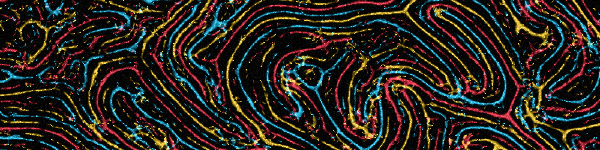

# Stigmergic Pixels

A real-time SDL2 experiment with agents initialized at random positions and moving in random directions. Each agent leaves a fading trail, senses nearby trail intensity and turns according to the enabled interaction rules. Species receive distinct colors, and agents never follow trails left by another species.

## Install and run on Windows

1. Download the ZIP from the [latest release](https://github.com/Bluzaborges/stigmergic-pixels/releases) and extract all its files into one folder.
2. Open the extracted folder and run `stigmergic-pixels.exe`.

## Requirements

- A C++17-compatible compiler
- CMake 3.21 or later
- Ninja
- SDL2

Git is also required during configuration because CMake downloads Dear ImGui 1.92.9 automatically.

### Windows with MSYS2

Install the development tools from an MSYS2 UCRT64 terminal:

```bash
pacman -S --needed git mingw-w64-ucrt-x86_64-toolchain mingw-w64-ucrt-x86_64-cmake mingw-w64-ucrt-x86_64-ninja mingw-w64-ucrt-x86_64-SDL2
```

### Debian and Ubuntu

```bash
sudo apt update
sudo apt install git build-essential cmake ninja-build libsdl2-dev
```

## Build

From the repository root:

```bash
cmake --preset release
cmake --build --preset release
```

This creates an optimized executable for normal use. Development builds use the `debug` preset, as described in the editor sections below.

## Controls

- `Attraction`: follow trails left by the same species
- `Repulsion`: avoid the shared trail with one species, or trails left by other species when multiple species are active
- `Agents`: change the population from 1 to 10,000,000 agents
- `Species`: divide the agents into one to eight color-coded species
- `Speed`: change movement speed while preserving continuous trails
- `Diffusion`: control how quickly trails spread into neighboring pixels
- `Evaporation`: control how quickly trails disappear
- `Reset`: clear the trails and randomize every agent again
- `Space`: pause or resume the simulation
- `R`: clear the trails and randomize every agent again
- `Escape`: close the application

## Visual Studio Code

Install the Microsoft **C/C++** and **CMake Tools** extensions. On Windows, open the repository from an MSYS2 UCRT64 terminal so the editor uses the correct toolchain:

```bash
cd /c/path/to/stigmergic-pixels
code .
```

If the `code` command is unavailable, add Visual Studio Code to `PATH` through its installer or launch its `bin/code` script directly.

CMake Tools recognizes the project presets automatically. Before debugging, open the command palette, run **CMake: Select Configure Preset**, and select **Debug**. Then add a breakpoint and run **CMake: Debug**.

The CMake Tools output should show `build/debug` as the build directory. **CMake: Debug** uses the selected build; it does not switch a Release build to Debug automatically. No `launch.json` is required.

Make sure the CMake Tools output references `C:\msys64\ucrt64` rather than `C:\mingw64`.

## Code::Blocks

Install Code::Blocks in the MSYS2 UCRT64 environment:

```bash
pacman -S --needed mingw-w64-ucrt-x86_64-codeblocks
```

From the repository root, generate a Code::Blocks project:

```bash
cmake -S . -B build/codeblocks -G "CodeBlocks - Ninja" -DCMAKE_BUILD_TYPE=Debug
```

CMake marks this generator as deprecated, but it can still generate the project. Open `build/codeblocks/stigmergic-pixels.cbp` in Code::Blocks and select the `stigmergic-pixels` target. Add a breakpoint beside a source line, then choose **Debug > Start / Continue**.

If Code::Blocks cannot find the debugger, open **Settings > Debugger**, select the default GDB configuration, and set its executable to `C:\msys64\ucrt64\bin\gdb.exe`.
